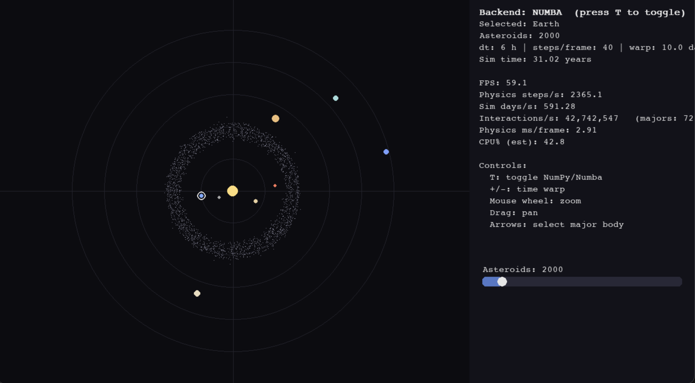

# N-body Solar System Simulator

An interactive two-dimensional numerical physics simulation of the Sun, the
eight planets, and a configurable asteroid belt. The project uses Newtonian
gravity, a kick-drift-kick integration step, NumPy, optional Numba-compiled
physics, and Pygame rendering.

## Preview



## Main technical ideas

- The Sun and eight planets participate in full pairwise N-body gravity.
- Asteroids are massless test particles: each asteroid feels gravity from the
  major bodies, but asteroids do not affect the planets or one another.
- A kick-drift-kick (velocity-Verlet/leapfrog-style) step advances positions
  and velocities.
- Initial conditions use approximate circular heliocentric orbits translated
  into a barycentric reference frame with zero total initial momentum.
- The same physics update is implemented with vectorized NumPy operations and
  explicit Numba-compiled loops.
- A logarithmic radial mapping makes the inner and outer planets visible in
  the same window. This display mapping is intentionally not to scale.

All physical calculations use SI units: metres, seconds, kilograms, and
metres per second.

## How the simulation works

For each physics step, the program calculates acceleration from Newtonian
gravity, applies half of the velocity update, advances positions, recalculates
acceleration, and completes the velocity update. Major bodies interact with
every other major body. Asteroid acceleration is calculated from major bodies
only, which keeps a large asteroid belt practical for an interactive program.

The default time step is six simulated hours, with multiple physics steps per
rendered frame. The HUD reports observed runtime information, but it is not a
controlled performance benchmark.

## Installation

The project was verified with Python 3.9.6. From the project directory:

```bash
python3 -m venv .venv
source .venv/bin/activate
python -m pip install -r requirements.txt
```

On Windows, activate the environment with `.venv\Scripts\activate`.

## Running the simulator

```bash
python SolarSim.py
```

The simulator starts with the NumPy backend. If Numba is available, it is
warmed up once at startup and can be selected while the program is running.

## Controls

| Input | Action |
| --- | --- |
| `T` | Toggle between NumPy and Numba physics |
| `+` / `-` | Increase or decrease physics steps per frame |
| Arrow keys | Select a major body |
| Mouse wheel | Zoom |
| Left-drag | Pan |
| `R` | Reset the view |
| `Esc` | Quit |
| Asteroid slider | Change the number of asteroid particles |

## NumPy and Numba backends

The NumPy backend expresses gravity with broadcast arrays. The Numba backend
uses explicit loops compiled with `@njit`. Both use the same equations and
integration sequence, and the test suite checks their one-step agreement.

The interactive HUD includes timing and interaction-rate estimates. These
numbers depend on rendering, frame limiting, hardware, and the current
particle count; no general performance claim is made from them.

## Reproducible asteroid generation

Interactive runs remain random by default. For tests or experiments,
`make_asteroids(..., seed=42)` produces the same positions and velocities for
the same Sun state and particle count.

## Physical assumptions

- Newtonian point-mass gravity in two dimensions.
- Approximate circular starting orbits rather than historical ephemeris data.
- A fixed gravitational softening length to avoid singular accelerations.
- Asteroids have no mass in the simulation.
- Planetary radii, collisions, moons, inclinations, relativity, and
  non-gravitational forces are not modeled.
- Planet colors and drawing sizes are visual choices, not physical scale.

## Known limitations

- The simulator is educational and is not intended for orbital prediction.
- The six-hour default step trades precision for interactive speed.
- `fastmath=True` in the Numba backend can permit small numerical differences.
- The compressed display distorts distances and orbit shapes on screen.
- Adding many asteroids can make either physics or per-pixel rendering the
  bottleneck.
- Backend timing in the interactive application is observational rather than
  a controlled benchmark.

## Tests

Install the development dependency and run:

```bash
python -m pip install -r requirements-dev.txt
python -m pytest
```

The focused tests cover gravity direction and force symmetry, barycentric
initial conditions, NumPy/Numba agreement, bounded two-body behavior, seeded
asteroid generation, and initialization relative to a moving Sun.

## Project structure

```text
SolarSim.py           Simulation, physics implementations, and Pygame UI
assets/               Screenshot and other repository media
tests/                Focused numerical tests
requirements.txt      Runtime dependencies
requirements-dev.txt  Test dependency
README.md             Project documentation
LICENSE               MIT License
```

## License

This project is available under the MIT License. See [LICENSE](LICENSE).
